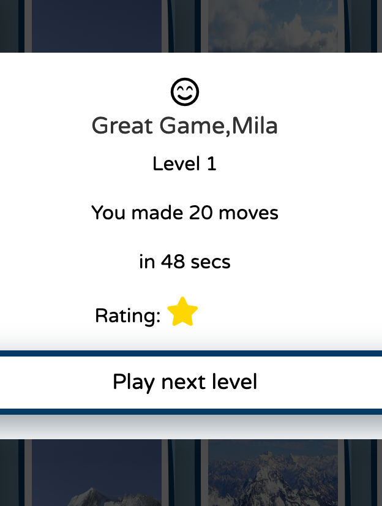
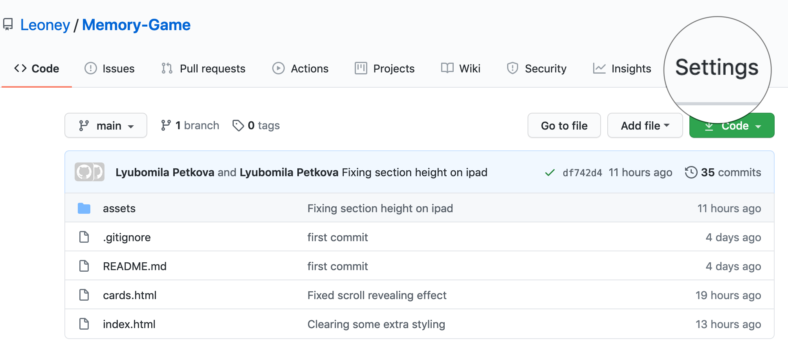

<h1 align="center">Memory Game</h1>

View the live project [here](https://leoney.github.io/Memory-Game/)

This is a single player memory match cards game with theme - The Eight Summits: "collective name for eight highest mountains in the seven continents". The intention is the game is not only to help improve the player's memory but trigger curiocity and interest in learning more about the highest summits on the seven continents.  
The game has the added benefit of being able to change increase the difficulty levels and rate the performance of the player.


## User Experience (UX)

### User stories

As a First Time Visitor I want to: 

- play a game to improve brain functions, such as attention, concentration, and focus.

- be able to easily navigate throughout the site to find content.

- have feedback on how well I am performing so as I can track any improvements in memory.

- learn something new by the theme of the game.

### Design

#### Colour Scheme

- The two main colors I have used for the game design are dark blue and white.

#### Typography

I have used two types of fonts: 
- 'Permanent Marker' with fallback on cursive font. 
- 'Varela Round' with fallback on sans-serif.

#### Imagery
- The large background image combined with parallax is designed to catch the user's attention.

    
### Wireframes

- Home Page Wireframe [view](https://github.com/Leoney/Memory-Game/blob/main/assets/wireframe/web_home_page.png)
- Rules Page Wireframe [view](https://github.com/Leoney/Memory-Game/blob/main/assets/wireframe/web_rules_page.png)
- Cards Deck Page Wireframe [view](https://github.com/Leoney/Memory-Game/blob/main/assets/wireframe/web_cards_page.png)
- Mobile Home Page Wireframe [view](https://github.com/Leoney/Memory-Game/blob/main/assets/wireframe/mobile_home_page.png)
- Mobile Rules Page Wireframe [view](https://github.com/Leoney/Memory-Game/blob/main/assets/wireframe/mobile_rules_page.png)
- Mobile Cards Deck Page Wireframe [view](https://github.com/Leoney/Memory-Game/blob/main/assets/wireframe/mobile_cards_page.png)

## Features

-   Responsive on all device sizes

-   Interactive elements

## Technologies Used

### Languages Used

-   HTML
-   CSS
-   JavaScript (ES6)

### Frameworks, Libraries & Programs Used

1. [Balsamiq](https://balsamiq.com/)
- wireframes application to create the site design

2. [Bootstrap (4.5.2):](https://getbootstrap.com/docs/4.5/getting-started/download/)
- it was used to assist with the responsiveness and styling of the website.

3. [Google Fonts:](https://fonts.google.com/) 
- it was used to import the 'Permanent Marker' and 'Varela Round' font into the style.css.

4. [Font Awesome:](https://fontawesome.com/)
- it was used on all pages throughout the website to add icons for aesthetic and UX purposes.

5. [Rellax JS:](https://dixonandmoe.com/rellax/)
- it was used on index page for the parallax effect.

6. [Greensock Animation API (GSAP):](https://dixonandmoe.com/rellax/)
- to create performant animations for the modals.

7. [ScrollReveal:](https://scrollrevealjs.org/)
-   used for the elements on the index page for smooth appearens on scrolling.

8. [Git:](https://git-scm.com/)
- used for version control.

9. [GitHub:](https://github.com/) 
- used to store the projects code after being pushed from Git.

10. [Freepick:](https://www.freepik.com/) 
- for the background image on the index page.

11. [Wikipedia:](https://en.m.wikipedia.org/) 
- for the 8 summits images used for the cards game.

12. [SASS](https://sass-lang.com/)
- to keep the css organised.


### JavaScript Game Logic

1. The game starts with a modal asking the player to fill out a name. If not an window alert is triggered, informing the player that it cannot be skipped.


2. On loading the page startGame() function starts. It is: 
- checking if this is the 4th game after 3 successfully completed games then null the countWin variable.
- empty the openedCards array 
- shuffle the cards via shuffle(cards)
- remove all exisiting classes from each card
- reset the moves/flips number to 0 
- reset the rating stars to full display (player starts with highest rating which decreases depending on the moves number)
- reset the timer to 0 
- reset the timeout timer to 0

3. The timer starts once the player clicks on first two cards whick counts for 1 flip. The timeout timer starts from the click of the first card. This causes 2 seconds difference between the timer displaied on the score panel and the timeout, that's why I have added 2000ms to the timeout timer as a temporary fix.

4. Once a card is clicked on a class open and a class disable is added to prevent double clicking on the same card and the card is pushed to openedCards array. 

5. Once the openedCards array length is equal to 2 the moves number is getting increased with one and the two cards are getting compared on the base of their dataset. 

6. If the cards match two classes are added to theirs - match and disable. The match class adds the card to matchedCard array and the disable one prevents the cards to be clicked again or turn over. 

7. If the cards don't match - first all cards are getting  disabled so only two selections can be made at once. In 1.1 seconds the the class open is removed from the two selected cards, then all cards are getting enabled again(except the cards that are already matched) nad the two unmatching cards can turn over again. The openedCards is reset and ready for next two selections.

8. If this is the first game for the player, then the countWin(representing the number of successfully completed games) will be 0 which means that this is the first level of the game and the timeout will be set to 60 seconds, if countWin is 1 then this will be level 2 and the timeout will be 55 seconds, for countWin larger than 1 - level 3 and 50 second time to complete it. 

9. If the time set in the timeout timer is over and the number of the matched cards is not 16 then the game is reset with startGame() and a modal appears with a button play again.


10. If the player match all cards before the set timeout is over, then a congratulations modal appears with the result from the game. On pressing the Play Next Level the game is reset with startGame().



## Testing

For testing my work in progress I was using Firefox and Google Chrome Developer Tools. The [W3C Markup Validator](https://validator.w3.org/#validate_by_input) and [W3C CSS Validator](https://jigsaw.w3.org/css-validator/#validate_by_input) Services were used to validate every page of the project to ensure there were no syntax errors in the project.

-   W3C Markup Validator: 
    - [Home Page Results](https://github.com/Leoney/Memory-Game/blob/main/assets/validation_results/index_page_html_validation.jpg) or [here](https://github.com/Leoney/Memory-Game/blob/main/assets/validation_results/index_page_html_validation.pdf)
    - [Cards Game Page Results](https://github.com/Leoney/Memory-Game/blob/main/assets/validation_results/cards_page_html_validation.jpg) or [here] (https://github.com/Leoney/Memory-Game/blob/main/assets/validation_results/cards_page_html_validation.pdf)
-   W3C CSS Validator - 
    - [Home Page Results](https://github.com/Leoney/Memory-Game/blob/main/assets/validation_results/index_page_w3c_css_validator_results.jpg) or [here](https://github.com/Leoney/Memory-Game/blob/main/assets/validation_results/index_page_w3c_css_validator_results.pdf)
    - [Cards Game Page Results](https://github.com/Leoney/Memory-Game/blob/main/assets/validation_results/cards_page_w3c_css_validator_results.jpg) or [here](https://github.com/Leoney/Memory-Game/blob/main/assets/validation_results/cards_page_w3c_css_validator_results.pdf)


### Further Testing

-   The Website was tested on Google Chrome,Mozilla Firefox, Safari, Microsoft Edge browsers.
-   The website was viewed on a variety of devices such as Desktop, Laptop, , iPad Mini, iPhone7, iPhone 8 & iPhoneX.
-   Friends and family members were asked to review the site and documentation to point out any bugs and/or user experience issues.

### Known bugs 

1. The parallax on the home page is not always smooth on scrolling.

2. The timer starts once the player clicks on first two cards whick counts 1 flip. The timeout timer starts from the click of the first card. This causes 2 seconds difference between the timer displaied on the score panel and the timeout, that's why I have added 2000ms to the timeout timer as a temporary fix.

3. There is a vertical white line in the middle of the cards on the turning them over. 

## Deployment

### GitHub Pages

To deploy the project on github pages the following steps were used:

1. Log in to GitHub and locate the GitHub [repository](https://github.com/Leoney/Memory-Game)
2. At the top of the Repository (not top of page), locate the "Settings" Button on the menu. 



3. Scroll down the Settings page until you locate the "GitHub Pages" Section.


4. Under "Source", if "None", click the dropdown and select "Main Branch". 

5. The page will automatically refresh.

6. Once completed an active link is published for the repository.

### Forking the GitHub Repository

By forking the GitHub Repository will be made a copy of the original repository on this GitHub account to view and/or make changes without affecting the original repository by using the following steps: 

1. Log in to GitHub and locate the [Memory-Game repository](https://github.com/Leoney/Memory-Game)
2. Under the repository name, click "Clone or download".
3. To clone the repository using HTTPS, under "Clone with HTTPS", copy the link.
4. Open Git Bash
5. Change the current working directory to the location where you want the cloned directory to be made.
6. Type ``` git clone ```, and then paste the URL you copied in Step 3.

```
$ git clone https://github.com/Leoney/Memory-Game.git
```

7. Press Enter. Your local clone will be created.

Click [Here](https://docs.github.com/en/free-pro-team@latest/github/creating-cloning-and-archiving-repositories/cloning-a-repository#cloning-a-repository-to-github-desktop) to retrieve pictures for some of the buttons and more detailed explanations of the above process.

## Credits

### Code

For this project I was using help from the following tutorials:
- for the parallax page: [Bedimcode](https://www.youtube.com/watch?v=JrU6bsuNU7Y), [DesignCourse](https://www.youtube.com/watch?v=P5zGTEGPpu4)(1), [DesignCourse](https://www.youtube.com/watch?v=aWJgIETz-Kk)(2)
- for the cards game: [PortEXE](https://www.youtube.com/watch?v=3uuQ3g92oPQ), [freeCodeCamp](https://www.youtube.com/watch?v=ZniVgo8U7ek), [Scotch](https://scotch.io/tutorials/how-to-build-a-memory-matching-game-in-javascript#toc-2-matching-cards), [Tania Rascia](https://www.taniarascia.com/how-to-create-a-memory-game-super-mario-with-plain-javascript/)

### Media

- [Freepick](https://www.freepik.com/) - for the background image on the index page.

- [Wikipedia](https://en.m.wikipedia.org/) - for the 8 summits images used for the cards game.

### Acknowledgements

-   My Mentor for continuous helpful feedback.

-   Tutor support at Code Institute for their support.